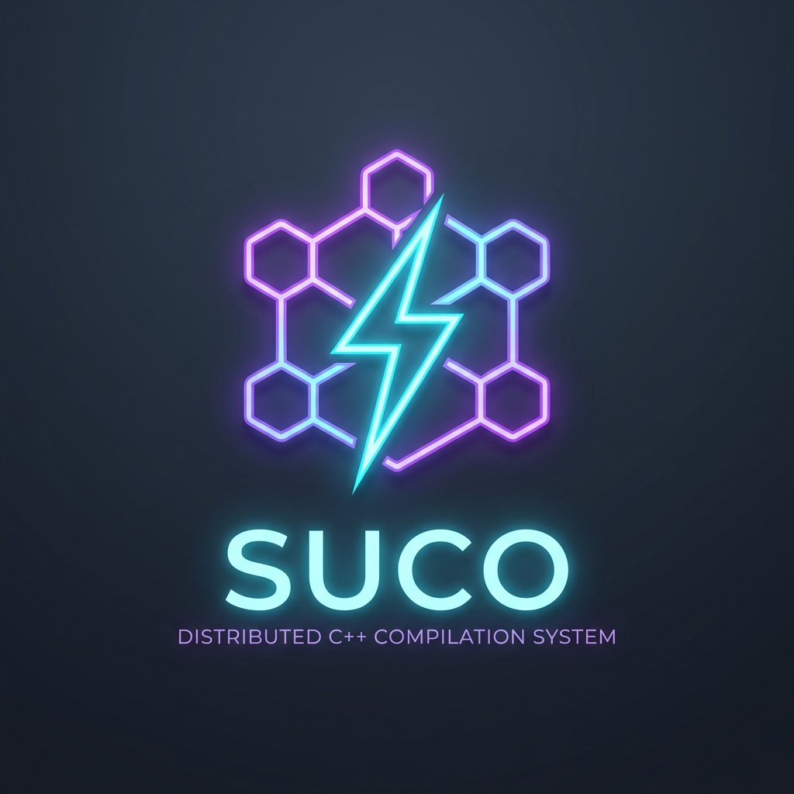
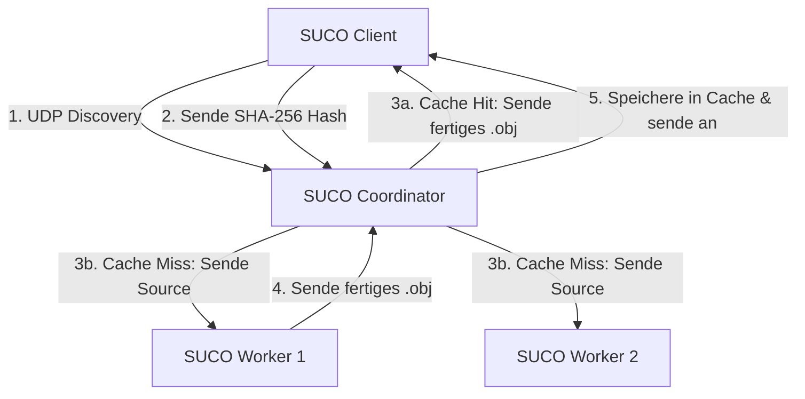
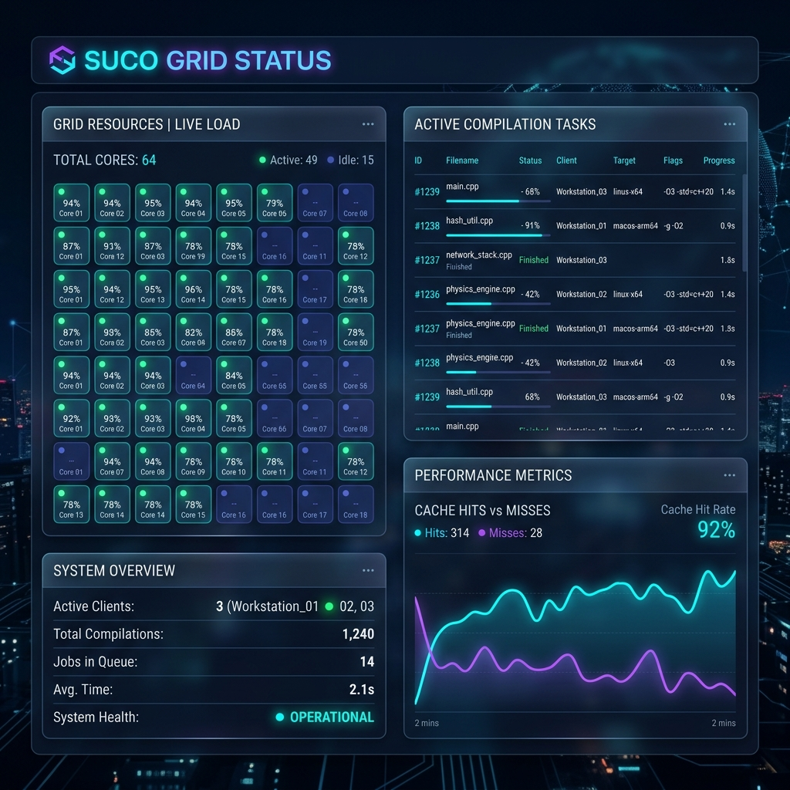

<p align="center">
  
</p>

<p align="center">
  
</p>

<h1 align="center">SUCO Lite</h1>
<p align="center">
  <strong>SUper COmpiler wrapper – Ein ultraschnelles, verteiltes C/C++ Kompilierungs- und Caching-System für lokale Netzwerke (LAN).</strong>
</p>

<p align="center">
  <a href="https://github.com/MicBur/suco/releases"></a>
  <a href="https://github.com/MicBur/suco/actions"></a>
  <a href="https://github.com/MicBur/suco/blob/main/LICENSE"></a>
</p>

---

SUCO Lite ist eine hochperformante, leichtgewichtige Alternative zu teuren proprietären Lösungen wie IncrediBuild oder veralteten Systemen wie Icecream. Es kombiniert Zero-Configuration-Setup per UDP Auto-Discovery, einen zweistufigen SSD LRU-Cache im Coordinator sowie ein modernes Web-Dashboard im Liquid-Glass-Design.

---

## 🚀 Benchmark-Ergebnisse (Die Cache-Power)

Ein Benchmark mit einer extrem großen C++-Datei (~318.000 Zeilen präprozessierter Code inklusive umfangreicher Standard-Header) verdeutlicht den massiven Performance-Gewinn:

| Zustand | Dauer | Beschreibung | Performance-Gewinn |
| :--- | :--- | :--- | :--- |
| **Cache Miss** | **25,5 s** | Erste Kompilierung. Client präprozessiert, Coordinator verteilt an Worker, Worker kompiliert und sendet `.obj` zurück. | - |
| **Cache Hit** | **0,7 s** | Erneute Kompilierung. Client präprozessiert, Coordinator findet SHA-256 in der SSD-Datenbank und sendet `.obj` sofort zurück. | **97,1% schneller** 🚀 |

### Warum ist der Cache so extrem schnell?
Der klassische C++ Kompilierungsprozess besteht aus vier Hauptphasen:
1. **Präprozessierung:** Expandieren von Makros, Auflösen von `#include`-Direktiven. Das ist primär schneller Text-I/O und geht extrem flink (Bruchteil einer Sekunde).
2. **Parsing & semantische Analyse:** Aufbau des Abstract Syntax Tree (AST), Auflösung komplexer Template-Instanziierungen (z. B. `<vector>`, `<map>`, Header-Only-Bibliotheken). Dies ist hochgradig CPU-intensiv.
3. **Optimierung:** Code-Optimierungen (`-O2`, `-O3`), Inlining, Loop Unrolling. Dies dauert am längsten.
4. **Codegenerierung:** Schreiben der Binärdatei (`.o` bzw. `.obj`).

**Der SUCO-Trick:** 
Der Client führt lokal *nur* die schnelle Präprozessierung (Phase 1) aus und berechnet den SHA-256 Hash der Ausgabe. Bei einem **Cache Hit** sendet der Coordinator die fertige `.obj`-Datei direkt aus dem SSD-LRU-Cache zurück. Die CPU-intensiven Phasen 2, 3 und 4 werden komplett übersprungen!

---

## 🛠️ Architektur & Funktionsweise

SUCO Lite besteht aus drei kleinen, nativen Komponenten (geschrieben in modernem C++ mit Winsock2/BSD Sockets und OpenSSL):



1. **SUCO Client (`suco`):**
   - Wird als Compiler-Wrapper (z. B. vor `g++` oder `cl.exe`) aufgerufen.
   - Präprozessiert die Quelldatei lokal (`-E` bzw. `/E`) und berechnet den SHA-256-Hash des Inhalts plus der Compiler-Flags.
   - Verbindet sich per UDP Auto-Discovery mit dem Coordinator und fragt den Hash an.
   - **Resilienter Fallback:** Falls der Coordinator in <100 ms nicht antwortet oder ausfällt, kompiliert der Client die Datei vollautomatisch lokal auf der Entwickler-Maschine. Der Build schlägt niemals fehl!

2. **SUCO Coordinator (`suco-coordinator`):**
   - Verwaltet den zweistufigen SSD LRU-Cache (indiziert über die ersten Zeichen des SHA-256-Hashes, z. B. `cache/ab/cdef...`).
   - Findet Worker vollautomatisch im LAN via UDP-Broadcasts auf Port `9002`.
   - Verteilt Kompilierjobs bei einem Cache-Miss intelligent per **Least-Loaded-Scheduling** (an den Worker mit den meisten freien Slots).
   - Hostet ein integriertes HTTP-Web-Dashboard (Port `9001`) zur Live-Visualisierung.

3. **SUCO Worker (`suco-worker`):**
   - Läuft im Hintergrund auf allen verfügbaren Rechnern im Netzwerk.
   - Meldet sich per UDP-Broadcast beim Coordinator an.
   - Empfängt die präprozessierte Quellcodedatei bei einem Cache-Miss und führt die eigentliche Kompilierung lokal aus. Da die Datei bereits präprozessiert ist, sind keine Header oder externen Abhängigkeiten auf dem Worker erforderlich (Zero-Config!).

---

## 💻 Installation & Build

### 1. Abhängigkeiten
- **Windows:** Visual Studio (MSVC mit C++-Unterstützung), CMake, OpenSSL.
- **Linux:** `build-essential`, `cmake`, `libssl-dev`.

### 2. Projekt bauen

#### Windows (PowerShell/VS Developer Command Prompt):
```powershell
cmake -B build -S . -DCMAKE_BUILD_TYPE=Release
cmake --build build --config Release
```
Die ausführbaren Dateien (`suco.exe`, `suco-coordinator.exe`, `suco-worker.exe`) befinden sich in `build/Release/`.

#### Linux / WSL:
```bash
cmake -B build_linux -S . -DCMAKE_BUILD_TYPE=Release
cmake --build build_linux
```
Die ausführbaren Dateien befinden sich in `build_linux/`.

---

## ⚙️ Starten & Konfiguration

### 1. Coordinator starten (Zentrale Instanz)
Starte den Coordinator auf einem zentralen Rechner im Netzwerk (z. B. auf einem Server oder deiner Entwickler-Workstation):
```bash
# Windows
.\build\Release\suco-coordinator.exe --cache-dir .\cache --max-cache-size-gb 50

# Linux
./build_linux/suco-coordinator --cache-dir ./cache --max-cache-size-gb 50
```

### 2. Worker starten (Auf allen Helfer-Rechnern)
Starte den Worker auf beliebig vielen Rechnern im lokalen Netzwerk. Sie finden den Coordinator vollautomatisch:
```bash
# Windows (--slots definiert die maximal parallelen Compiler-Prozesse)
.\build\Release\suco-worker.exe --slots 8

# Linux
./build_linux/suco-worker --slots 8
```

### 3. Client verwenden (In deinen Builds)
Ersetze in deinen Makefiles, CMake-Dateien oder Build-Skripten den Compiler-Aufruf durch `suco`.

**Beispiel Windows (MSVC):**
```powershell
.\build\Release\suco.exe cl.exe /O2 /std:c++17 /c test.cpp /Fo test.obj
```

**Beispiel Linux (GCC):**
```bash
./build_linux/suco g++ -O3 -std=c++17 -c test.cpp -o test.o
```

---

## 📊 Live Web-Dashboard
Der Coordinator stellt unter `http://localhost:9001` ein schickes, interaktives Dashboard zur Verfügung:
* **Echtzeit-Statistiken:** Cache-Hits, Cache-Misses, Hit-Rate in %.
* **Worker-Übersicht:** Live-Liste der CPU-Auslastung aller Kerne.
* **Verbindungsstatus:** Zeigt aktive Kompilierungen mit tickenden Timern an.

<p align="center">
  
</p>
