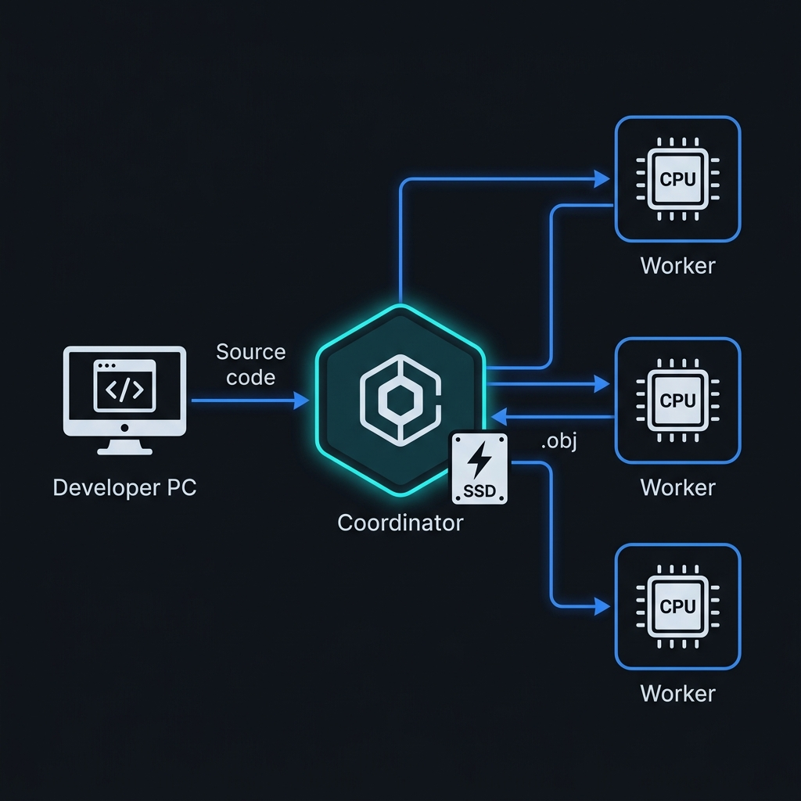

<p align="center">
  
</p>

<p align="center">
  
</p>

<h1 align="center">SUCO</h1>
<p align="center">
  <strong>SUper COmpiler Grid – Distributed C/C++ Compilation and Caching System for Local Networks.</strong>
</p>

<p align="center">
  <a href="https://github.com/MicBur/suco/actions/workflows/ci.yml"></a>
  <a href="https://github.com/MicBur/suco/releases"></a>
  <a href="#"></a>
  <a href="#"></a>
  <a href="#"></a>
</p>

<p align="center">
  <em>Compile once. Cache forever. Distributed builds with zero configuration.</em>
</p>

---

## ⚡ At a Glance

SUCO is a **high-performance, lightweight alternative** to expensive proprietary solutions like IncrediBuild or legacy systems like Icecream/distcc. It is designed for **maximum speed with minimal setup**:

- 🔍 **Zero-Config Auto-Discovery** – Workers automatically discover the coordinator via UDP Broadcast.
- 💾 **Intelligent SSD Cache** – SHA-256-based LRU cache with metadata tracking and versioned keys.
- 📊 **Live Web Dashboard** – Real-time monitoring of all workers, CPU cores, cache hit rate, and compile history.
- 🚀 **Direct Data Path (Direct Dispatch)** – Compilation data streams directly from clients to workers, avoiding coordinator bottlenecks.
- ⚖️ **Load-Aware CPU Scheduling** – Heartbeat-based CPU load monitoring dynamically scores workers to prevent node saturation.
- 🔄 **Least-Recently-Assigned Scheduling** – Fair Round-Robin tie-breaking distributes parallel compile threads uniformly.
- 🛡️ **Transparent Grid Failover** – If a worker goes offline, the coordinator immediately reschedules the jobs.
- ↩️ **Resilient Client Fallback** – If the coordinator fails, the client seamlessly falls back to local compilation in <100ms.
- 🖥️ **Cross-Platform** – Native support for Windows (MSVC) and Linux (GCC/Clang).
- 🪟 **MSVC Environment Detection** – Automatically locates Visual Studio under Windows and imports the MSVC build environment.
- 🛠️ **CMake & IDE Integration** – Easy integration via `SUCO.cmake` and automatic `compile_commands.json` wrapper prefix cleaning.
- 🧼 **Grid-Wide Cache Clearing** – Clean all local and remote caches via `suco cache clear`.
- 🤝 **Path Normalization** – Cross-directory cache hits via path mapping and `-ffile-prefix-map` integration.

---

## 🏆 Benchmark Results

### ⏱️ Distributed GoogleTest Build Suite (108 C++ Files, `-j17`)
> Tested on a real grid with **4× Nodes** (parallelized using `-j17`):

| Build System | Duration | Speedup vs Native | Notes / Description |
|---|---|---|---|
| 🖥️ **Native g++** | 50.83s | 1.00x (Baseline) | Pure local compilation. |
| 🍦 **Icecream** | 55.34s | 0.92x | Distributed compilation routed via `iceccd` daemon. |
| ❄️ **SUCO Cold** | 84.61s | 0.60x | First run on a cleared cache (includes preprocessor & network overhead). |
| 🔥 **SUCO Hot** | **13.25s** 🚀 | **3.84x** ⚡ | 100% Cache Hits. Bypasses compiler phases completely via global SSD caching! |

### ⏱️ Small Project Build Benchmark (40 C++ Files, `-j8`)
> Tested on the same grid (parallelized using `-j8`):

| Build System | Duration | Speedup vs Native | Notes / Description |
|---|---|---|---|
| 🖥️ **Native g++** | 1.13s | 1.00x (Baseline) | Local native build. |
| 🍦 **Icecream** | 1.22s | 0.93x | Distributed via `iceccd`. |
| ❄️ **SUCO Cold** | 3.42s | 0.33x | Initial cold run. |
| 🚀 **SUCO Warm** | **1.12s** ⚡ | **1.01x** | Skips compilation entirely and pulls `.o` objects from coordinator. |

### Why is the Cache so fast?

```
Normal Build:             SUCO Cache Hit:
┌──────────────┐         ┌──────────────┐
│ Preprocessor │ ~0.1s   │ Preprocessor │ ~0.1s
├──────────────┤         ├──────────────┤
│ Parser/AST   │ ~3.0s   │ SHA-256 Hash │ ~0.001s
├──────────────┤         ├──────────────┤
│ Optimization │ ~15.0s  │ Cache Lookup │ ~0.002s
├──────────────┤         ├──────────────┤
│ Codegen      │ ~7.0s   │ SSD → Client │ ~0.5s
└──────────────┘         └──────────────┘
     ~25s                    ~0.7s
```

The client performs **only the preprocessing** phase locally and computes a SHA-256 hash. On a cache hit, CPU-intensive compiler phases (parsing, optimization, codegen) are **completely skipped** — the finished `.obj` file is fetched directly from the SSD cache.

---

## 🏗️ Architecture

<p align="center">
  
</p>

SUCO consists of several native C++20 components:

```
                   ┌────────────────────────────────────────────────────────┐
                   │                     DEVELOPER MACHINE                  │
                   │  ┌───────────────┐                                     │
                   │  │     suco      │ (Entry Point / Build Wrapper)       │
                   │  └───────┬───────┘                                     │
                   │          │ Sets CC/CXX to suco-cl/suco-cl++            │
                   │          ▼                                             │
                   │  ┌───────────────┐     ┌────────────────────────────┐  │
                   │  │ suco-cl/cl++  │────▶│      SUCO COORDINATOR      │  │
                   │  │ (Compiler Wrp)│◀───│  ┌──────────┐ ┌──────────┐  │  │
                   │  └───────────────┘     │  │SSD Cache │ │Dashboard │  │  │
                   │                        │  │(5GB LRU) │ │  :9001   │  │  │
                   │                        │  └──────────┘ └──────────┘  │  │
                   └────────────────────────┴───────┬────────────────────┘  │
                                                    │ TCP :9000
                                    ┌───────────────┼───────────────┐
                                    ▼               ▼               ▼
                           ┌──────────────┐ ┌──────────────┐ ┌──────────────┐
                           │  WORKER #1   │ │  WORKER #2   │ │  WORKER #3   │
                           │  HP Mini G2  │ │  HP Mini G2  │ │  HP Mini G2  │
                           │  4 Cores     │ │  4 Cores     │ │  4 Cores     │
                           └──────────────┘ └──────────────┘ └──────────────┘
                                    UDP Auto-Discovery :9002
```

### Components

| Component | Description |
|---|---|
| **`suco`** (Wrapper) | The main build wrapper. Intercepts build commands (`make`, `ninja`, `cmake`), overrides environment variables `CC`/`CXX` and delegates to `suco-cl`/`suco-cl++`. |
| **`suco-cl` / `suco-cl++`** | The actual compiler wrappers. Preprocesses source files locally, calculates SHA-256 hashes and interacts with the coordinator. |
| **`suco-coordinator`** | Central grid hub. Manages the SSD LRU cache, distributes jobs (least-loaded scheduling), and hosts the live web dashboard. |
| **`suco-worker`** | Compilation node. Registers via UDP, compiles preprocessed sources, and returns compiled binaries. |

### 🛠️ Wrapper Subcommands

The `suco` wrapper includes a clean OOP-based subcommand system:

- **`suco setup`**: Interactive setup assistant (configures Coordinator host, port, slots, log level, detects local compilers and performs connection verification).
- **`suco status`**: Shows grid coordinator state, cache hit rate, and real-time slots usage.
- **`suco workers`**: Lists all registered worker nodes grouped by compilers, tools and Qt versions.
- **`suco cache clear`**: Clears local caches and triggers PCH/object cache cleanup across the entire grid.
- **`suco config show`**: Displays currently active client configurations and paths.
- **`suco help`**: Prints usage instructions for available subcommands.

### Cache Key Format

The cache uses a **versioned, metadata-rich hash key**:

```
v3:⟨0x1F⟩Target⟨0x1F⟩CompilerVersion⟨0x1F⟩Standard⟨0x1F⟩Defines⟨0x1F⟩Includes⟨0x1F⟩Flags⟨0x1F⟩NormalizedSource
```

- **Versioning**: `v3:` prefix for schema migrations (updated for path normalization and compression flags).
- **Metadata**: Target architecture, compiler version, language standard, sorted defines & include paths.
- **Source Normalization**: Strips `#line` directives, empty lines, and normalizes paths (optimized using `memchr` for 300k+ lines in <5ms).
- **Separator**: ASCII `0x1F` (Unit Separator) — guaranteed not to conflict with normal code contents.

### 📦 Precompiled Headers (PCH) Support

SUCO includes a hybrid PCH processing mechanism:

- **PCH Detection**: Parses common PCH options for MSVC (`/Yu`, `/Yc`, `/Y-`, `/Fp`) and GCC/Clang (`-include-pch`, `-fpch-preprocess`, `.gch`, `.pch`).
- **Hybrid Distribution**:
  - **PCH Creation** (e.g. compiling `stdafx.h` to `.gch`): Executed **locally** on the client to avoid copying large header sets over the network.
  - **PCH Usage** (compiling `.cpp` source files using the PCH): Executed **remotely** in the grid. The client strips PCH flags and preprocessor directives, and uploads fully expanded source code to ensure portability on grid workers.

### ⚡ Thread-Safe Logging

Client, coordinator, and worker use a unified thread-safe logging library:

- **Granular Log Levels**: Configured via the `SUCO_LOG_LEVEL` environment variable (`DEBUG`, `INFO`, `WARN`, `ERROR` - default is `INFO`).
- **Performance Optimized**: Inline compile-time guards prevent `std::format` string construction for disabled log levels.
- **Timestamps**: Console output is structured as: `[YYYY-MM-DD HH:MM:SS] [LEVEL] Message`.

---

## 💻 Installation

### Dependencies

| Platform | Packages |
|---|---|
| **Windows** | Visual Studio (MSVC), CMake ≥ 3.15, OpenSSL, zstd (via vcpkg) |
| **Linux** | `build-essential`, `cmake`, `libssl-dev`, `libzstd-dev` |

### Building

```bash
# Linux / WSL
cmake -B build_linux -S . -DCMAKE_BUILD_TYPE=Release
cmake --build build_linux

# Windows (Developer PowerShell)
cmake -B build -S . -DCMAKE_BUILD_TYPE=Release -DCMAKE_TOOLCHAIN_FILE=C:/vcpkg/scripts/buildsystems/vcpkg.cmake
cmake --build build --config Release
```

### Installation (Linux)

**Option A — Debian/Ubuntu package (recommended for grids):** reproducible, versioned, upgradable.

```bash
# Build the package once…
cd build_linux && cpack -G "TGZ;DEB"
# …then install it on every node:
sudo apt install ./suco-lite_0.9.0_amd64.deb

# Nothing starts automatically. Enable the role each node should play:
sudo systemctl enable --now suco-worker                    # compile node
sudo systemctl enable --now suco-coordinator suco-worker   # head node
suco --version                                             # verify the build
```

Installs binaries to `/usr/bin/`, systemd units to `/usr/lib/systemd/system/` (shipped **disabled** —
a fresh install never silently joins a running grid), dashboard to `/usr/share/suco/`. To enable
grid-wide auth, set `SUCO_SECRET` in the unit (or an `EnvironmentFile`) on every node and restart.

**Option B — interactive installer:**

```bash
sudo bash install.sh
# Choose: 1) Coordinator + Worker   2) Worker Only
```

The installer installs binaries to `/usr/local/bin/`, registers systemd daemons, and opens ports in the firewall.

---

## ⚙️ Usage

### 1. Start Coordinator

```bash
./suco-coordinator
# Dashboard: http://localhost:9001
# Cache: ~/.cache/suco/ (Default: 5 GB SSD cache with LRU eviction)
```

### 2. Start Worker (on grid nodes)

```bash
# Auto-Discovery (discovers coordinator automatically via UDP)
./suco-worker --slots 4

# Manual Address config
./suco-worker --coordinator 192.168.0.200:9000 --slots 8
```

### 3. Compile via SUCO

```bash
# Linux (GCC)
suco g++ -O3 -std=c++20 -c myfile.cpp -o myfile.o

# Windows (MSVC)
suco cl.exe /O2 /EHsc /c myfile.cpp /Fo myfile.obj

# In CMake Lists
set(CMAKE_CXX_COMPILER_LAUNCHER suco)
```

---

## 📊 Live Web Dashboard

<p align="center">
  
</p>

The built-in dashboard on **port 9001** visualizes:

- 🟢 **Worker Nodes Status** and CPU core utilization.
- 📈 **Cache Hit Rate** via animated circular gauges.
- ⚡ **Active Compilations** with runtime indicators.
- 📋 **Job History** with hit/miss indicators.

---

## 🔧 Network Ports

| Port | Protocol | Purpose |
|---|---|---|
| `9000` | TCP | Remote compilations (Client ↔ Coordinator ↔ Worker) |
| `9001` | TCP | Live dashboard and REST stats API |
| `9002` | UDP | Grid auto-discovery broadcasts |

---

## 🤝 Comparison with Alternatives

| Feature | SUCO | IncrediBuild | Icecream | distcc |
|---|:---:|:---:|:---:|:---:|
| **Price** | ✅ Free | ❌ ~$2000/license | ✅ Free | ✅ Free |
| **SSD Caching** | ✅ SHA-256 LRU | ✅ Proprietary | ❌ No | ❌ No |
| **Auto-Discovery** | ✅ UDP Broadcast | ✅ Central Broker | ✅ mDNS | ❌ Manual config |
| **Web Dashboard** | ✅ Glassmorphism | ✅ GUI Client | ⚠️ Icemon | ❌ No |
| **Windows + Linux**| ✅ Native | ⚠️ Windows-only | ✅ Yes | ✅ Yes |
| **Zero-Config Worker**| ✅ Yes | ❌ Agent needed | ✅ Yes | ❌ Manual config |
| **Resilient Fallback**| ✅ <100ms | ⚠️ Slow fallback | ❌ No | ❌ No |
| **Setup Time** | ✅ ~2 mins | ❌ ~30 mins | ⚠️ ~10 mins | ⚠️ ~15 mins |

## 🗺️ Roadmap

To see the planned milestones, future scaling goals, and how we plan to close the performance gap with commercial solutions, check out our [Project Roadmap](docs/ROADMAP.md) and the [Remote Preprocessing Design](docs/remote_preprocessing_design.md).

---

## 📜 License

MIT License – See [LICENSE](LICENSE) for details.

---

<p align="center">
  <sub>Created by Michael Burzlaff. Developed with ⚡ by <a href="https://github.com/MicBur">MicBur</a></sub>
</p>
