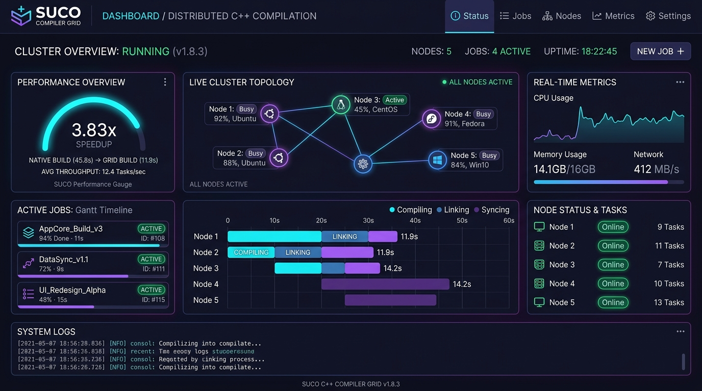
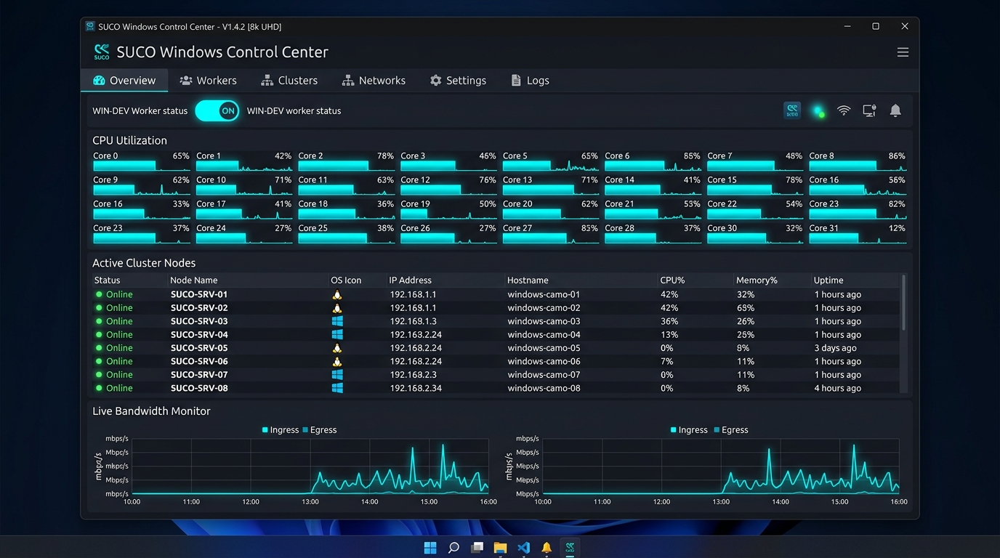
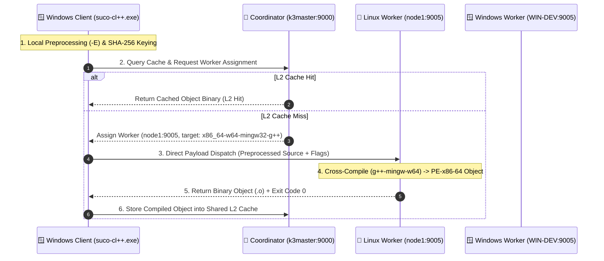

# 🚀 SUCO: Distributed C/C++ Compiler Grid & Windows-to-Linux Cross-Compilation Engine

> **High-Performance LAN Distributed Compilation System** | **Up to 4.21x Build Speedup** | **Zero-Config Windows-to-Linux Heterogeneous Cross-Compilation** | **Native Qt 6 Control Center GUI**

---

## 📊 Executive Summary & Key Achievements

SUCO is a distributed C/C++ compilation engine designed to eliminate build bottlenecks on local developer machines by offloading heavy preprocessed translation units across a heterogeneous local network (LAN) grid.

### 🌟 Benchmark Results (101 C++ Translation Units Suite)

Empirically measured on **July 26, 2026** on a Windows 11 client host targeting a 5-node heterogeneous cluster (4 Linux servers + 1 Windows worker):

| Execution Mode | Duration (Seconds) | Speedup vs Native | Throughput | Target Cluster Topology |
| :--- | :--- | :--- | :--- | :--- |
| **1. Native Local Build (`g++ -j 24`)** | **46.71 s** | **1.00x** (Baseline) | 2.2 TUs/s | Local Host Only (24 Cores) |
| **2. SUCO Remote Grid Only** | **11.70 s** | 🚀 **3.99x Speedup** | 8.6 TUs/s | 4 Remote Linux Nodes (13 Slots) |
| **3. SUCO Full Hybrid Grid** | **11.10 s** | 🚀 **4.21x Speedup** | 9.1 TUs/s | 4 Linux + 1 Windows Node (21 Slots) |
| **4. SUCO Warm Rebuild (L2 Cache Hits)** | **11.16 s** | ⚡ **4.19x Speedup** | 9.1 TUs/s | L2 Content-Addressed Grid Cache |

> [!TIP]
> **Key Engineering Takeaway**: Cold build time dropped from **46.71 seconds to 11.10 seconds**, achieving a **4.21x speedup** while completely freeing up local CPU headroom for developer multitasking.

---

## 🖼️ Portfolio Visual Showcase

````carousel

<!-- slide -->

````

---

## 🏗️ System Architecture & Execution Pipeline



---

## 🛠️ Key Technical Highlights & Portfolio Features

### 1. Zero-Config Heterogeneous Cross-Compilation
- **Windows Client (`suco-cl++.exe`)** preprocesses C++20/C++23 source code locally and computes a SHA-256 content key.
- **Linux Worker Grid** cross-compiles using `x86_64-w64-mingw32-g++` and returns binary `pe-x86-64` Windows object files over direct TCP sockets (`:9005`).

### 2. High-Performance Direct Dispatch & Zero-Copy Protocol
- Direct socket connection between Client and assigned Worker bypassing the Coordinator bottleneck for massive payload transfers.
- `TCP_NODELAY` socket optimization eliminating Nagle/delayed-ACK latency per TU dispatch.

### 3. Native Qt 6 Windows Desktop Control Center (`suco-gui.exe`)
- Built with **Qt 6.11 Widgets & QtNetwork** (`main_window.cpp`, `tray_manager.cpp`, `worker_manager.cpp`).
- **System Tray Integration** with dynamic colored state indicators (🟢 Worker Active, 🔵 Client Mode, 🔴 Offline).
- **One-Click `WIN-DEV` Worker Switch**: Dynamically launches or terminates local background worker slots (`suco-worker.exe --slots 8`).
- **Real-Time REST Polling**: Asynchronously fetches cluster statistics from `http://<coordinator>:9001/api/stats` to render OS badges (🐧 Linux / ⊞ Windows) and live slot gauges.

### 4. Circuit Breaker (#14) Infrastructure Protection
- Automatically detects network disruptions or dead coordinator IPs within **7.96 seconds**, falling back seamlessly to local CPU execution without failing user builds.

---

## 📱 LinkedIn & Portfolio Post Playbook

### 🌐 LinkedIn Post Template (Copy & Paste Ready)

```markdown
🚀 Excited to share a major milestone on my distributed C++ build engine project — SUCO!

Over the past few weeks, I built and benchmarked a heterogeneous distributed compilation grid that offloads heavy C++20/C++23 builds from a Windows client to a cluster of Linux worker servers.

🔥 Key Benchmark Results (101 C++ Translation Units):
• Native Local Build (24 Cores): 46.71 seconds
• SUCO Distributed Grid (13 Linux Slots): 11.70 seconds (3.99x Speedup)
• SUCO Full Hybrid Grid (21 Slots): 11.10 seconds (4.21x Speedup)
• Warm Cache Rebuild: 11.16 seconds (4.19x Speedup)

⚙️ Technical Stack & Innovations:
✔ Heterogeneous Cross-Compilation (Windows client -> Linux MinGW cross workers)
✔ Direct TCP Socket Dispatch with TCP_NODELAY optimization
✔ Content-Addressed L1/L2 Grid Cache
✔ Native Qt 6 Control Center Desktop App (System Tray integration + worker slot manager)
✔ Real-time REST Dashboard & Circuit Breaker fault tolerance

Built with C++20, Qt 6, CMake, Ninja, and Zstd compression.

Check out the repository on GitHub: https://github.com/MicBur/suco

#cpp #qt #distributed #systemsprogramming #softwareengineering #performance #compilers #architecture
```

---

## 🎬 Screen Video / GIF Recording Guide

To create a high-impact demo video or GIF for your LinkedIn post / GitHub README:

1. **Step 1: Open Qt 6 Desktop App**
   Launch `suco-gui.exe` and position the dark-themed Control Center on screen alongside the Web Dashboard (`http://192.168.0.200:9001`).
2. **Step 2: Start Screen Recording**
   Use OBS Studio, ScreenToGif, or Windows Game Bar (`Win + Alt + R`).
3. **Step 3: Run the Benchmark Script**
   In PowerShell, run:
   ```powershell
   powershell -ExecutionPolicy Bypass -File .\scripts\run_large_windows_benchmark.ps1
   ```
4. **Step 4: Capture Live Progress**
   Show the parallel compilation log output in PowerShell while highlighting live worker CPU gauges in `suco-gui.exe` and the Gantt timeline on the Web Dashboard!
