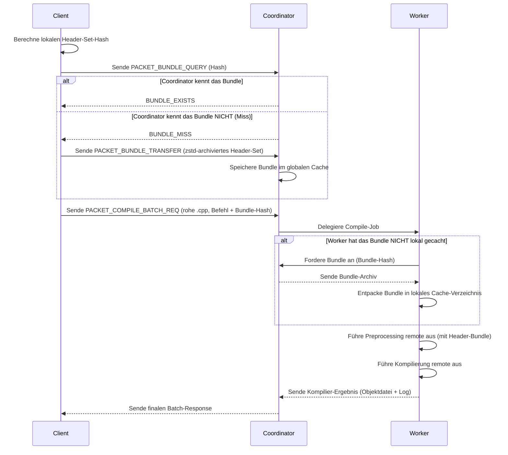

# Design-Dokument — T4: Konzept für Remote-Preprocessing

Dieses Dokument beschreibt das Konzept und das technische Design für das optionale Feature **Remote-Preprocessing** in SUCO. Dieses Feature zielt darauf ab, die Netzwerklast und den lokalen CPU-Aufwand während des Preprocessing-Schritts auf dem Client zu reduzieren.

---

## 1. Motivation und Ziel

Im aktuellen Design von SUCO führt der Client das Preprocessing (den Aufruf von `gcc -E` bzw. `cl.exe /E`) lokal aus. Der resultierende, vollständig expandierte Quelltext (oft 1–3 MB pro Translation Unit) wird an den Coordinator gesendet. Bei stark parallelisierten Builds führt dies zu:
1. **Hoher lokaler CPU-Last** durch Hunderte von Compiler-Aufrufen für das Preprocessing.
2. **Hoher Netzwerklast** durch das Hochladen von Megabytes an preprozessiertem Quellcode über das Netzwerk für jede einzelne Datei.

**Ziel des Remote-Preprocessing:**
Der Client sendet nur noch die rohe `.cpp`-Datei und ein Inhalts-adressiertes Bundle von Header-Dateien (Header-Set-Hash) an den Worker. Das Preprocessing läuft direkt auf dem remote Worker, was den Upstream-Verkehr drastisch reduziert und den Client entlastet.

---

## 2. Technisches Konzept

### 2.1 Header-Set-Hashing & Bundle-Erstellung
Der Client analysiert die Abhängigkeiten der Translation Unit über einen schnellen, leichtgewichtigen Abhängigkeitsscanner (z. B. durch Parsen von `#include`-Direktiven oder einen minimalen Compiler-Lauf mit `-M` / `-MM`).
- Die gefundenen Header-Dateien werden zu einem **Header-Set** zusammengefasst.
- Ein SHA-256-Hash wird über den Inhalt all dieser Header berechnet (**Header-Set-Hash**).
- Die Header-Dateien werden in einem komprimierten Archiv (z. B. `.tar.zst`) zusammengefasst (**Header-Bundle**).

### 2.2 Bundle-Granularität
Um die Archiv-Größen klein zu halten, wird zwischen zwei Header-Klassen unterschieden:
1. **System-Header (z. B. `/usr/include/`, Qt-Systempfade):** Diese werden *nicht* in das Bundle gepackt. Es wird davon ausgegangen, dass kompatible Worker über identische System-Toolchains verfügen. Die Auflösung erfolgt remote über die Toolchain des Workers.
2. **Projekt-Header (lokale Includes):** Alle Header-Dateien innerhalb des Checkout-Roots werden erfasst und in das Bundle gepackt.

### 2.3 Cache-Invalidierung auf dem Client
- Der Client berechnet vor jedem Kompilieren den Header-Set-Hash der lokalen Abhängigkeiten.
- Hat sich ein Header geändert, ändert sich der Hash. Der Client stellt beim Coordinator eine Abfrage (`PACKET_BUNDLE_QUERY`).
- Existiert der neue Hash nicht im Coordinator-Cache, wird das neue Bundle hochgeladen. Veraltete Bundles werden nach dem LRU-Prinzip aus dem Coordinator-Cache gelöscht.

---

## 3. Protokoll-Erweiterung

Das SUCO-Protokoll wird um folgende Pakettypen erweitert:

1. **`PACKET_BUNDLE_QUERY (19)`**: Client fragt an, ob der Coordinator ein bestimmtes Header-Bundle (identifiziert durch den SHA-256-Hash) bereits besitzt.
2. **`PACKET_BUNDLE_TRANSFER (20)`**: Client lädt das `.tar.zst`-Header-Bundle hoch, falls der Coordinator einen Miss meldet.
3. **`PACKET_BUNDLE_REQ (21)`**: Ein Worker fordert ein fehlendes Header-Bundle vom Coordinator an.

---

## 4. Fallback-Szenarien bei Misses

1. **Worker-Cache-Miss:** Wenn ein Worker einen Job erhält, aber das entsprechende Header-Bundle nicht in seinem lokalen Cache hat, fordert er es vom Coordinator an. Schlägt dies fehl (z. B. Netzwerkfehler), meldet der Worker einen Fehler an den Coordinator, und der Coordinator veranlasst ein Rescheduling auf einen anderen Worker.
2. **Netzwerk-Timeout:** Schlägt die Übertragung eines Bundles fehl oder bricht die Verbindung ab, fällt der Client sofort auf lokales Preprocessing und lokale Kompilierung zurück.

---

## 5. Zusammenspiel mit T1/T2 (Kompression)

- Das Header-Bundle wird unter Verwendung der in T2 implementierten Zstd-Kompression komprimiert.
- Der Client verwendet den configured standardmäßig aktivierten Kompressionslevel (`SUCO_COMPRESSION_LEVEL`), um das Bundle vor dem Upload zu packen.
- Da Projekt-Header oft hohe Redundanzen aufweisen, erzielt Zstd extrem hohe Kompressionsraten (oft > 85%), was den initialen Upload-Bottleneck weiter minimiert.

---

## 6. Offene Designfragen

1. **Abhängigkeitsscanning-Overhead:** Ist ein lokaler Compiler-Aufruf mit `-MM` zur Bestimmung der Header schneller als das direkte Preprocessing? Für große TUs könnte ein eigener, in C++ geschriebener, extrem schneller Pre-Scanner (wie in ccache) notwendig sein.
2. **System-Header-Drift:** Was passiert, wenn ein System-Header auf dem Worker eine leicht andere Version hat als auf dem Client (z. B. durch Minor-Updates)? Dies könnte zu subtilen Compilierfehlern oder undefiniertem Verhalten führen. Sollten System-Header optional mit ins Bundle aufgenommen werden können?
3. **Include-Pfad-Mapping:** Wie mappt der Worker die Include-Pfade (`-I` Flags) auf die temporär entpackte Struktur des Header-Bundles? Der Worker muss die Include-Flags so umschreiben, dass sie auf das entpackte Verzeichnis des Bundles zeigen.
