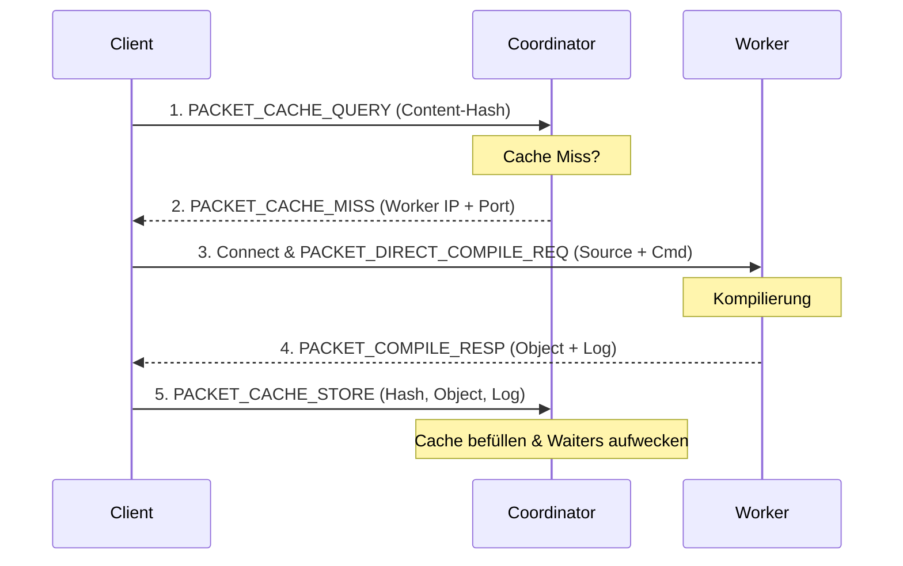

# T12 — Scaling Design: Direct Data Path & Local Worker

Dieses Dokument beschreibt das Design für den **Direkten Datenpfad** zwischen Client und Worker sowie die Integration der **lokalen Maschine als Worker** im SUCO-Grid (Roadmap v2.2).

---

## 1. Direkter Datenpfad (Client ↔ Worker)

Bisher liefen alle Quelldaten (preprocessed source) und kompilierten Objekte (object files) über den Coordinator. Bei parallelen Builds mit vielen Nodes wurde der Coordinator zum Flaschenhals für Netzwerk-I/O.

Im neuen Design vermittelt der Coordinator nur noch das Scheduling und den Cache-Index. Die eigentlichen Payloads fließen direkt zwischen Client und Worker.

### 1.1 Protokoll-Ablauf

### 1.2 Worker TCP Listener

*   Der Worker startet einen eigenen TCP Listener (Standard-Port `9003` oder dynamisch zugewiesen).
*   Der Port wird im Registrierungs-Paket (`PACKET_HEARTBEAT` / Registrierungs-Payload) an den Coordinator gemeldet.
*   Er empfängt direkte Verbindungen von Clients und verarbeitet `PACKET_DIRECT_COMPILE_REQ`.

### 1.3 Coordinator Scheduling & Cache-Miss

*   Bei `PACKET_CACHE_QUERY` prüft der Coordinator den globalen Cache.
*   Bei einem **Cache-Hit** liefert der Coordinator das Objekt weiterhin direkt aus (Vermeidung von Worker-I/O).
*   Bei einem **Cache-Miss** reserviert der Coordinator einen Slot auf dem am wenigsten ausgelasteten Worker und sendet dessen IP und Direkt-Port im `PACKET_CACHE_MISS` zurück.

### 1.4 Cache-Befüllung

*   Nachdem der Client das kompilierte Objekt vom Worker empfangen hat, sendet er ein asynchrones `PACKET_CACHE_STORE` an den Coordinator, um den globalen Cache zu befüllen und eventuell wartende Clients (`PACKET_CACHE_WAIT`) aufzulösen.

---

## 2. Lokale Maschine als Worker

Um Ressourcen optimal zu nutzen, soll die lokale Entwickler-Maschine (Client) als Worker im Grid fungieren.

*   Der lokale Client-Host startet im Hintergrund einen Worker-Threadpool mit einer konfigurierbaren Anzahl von Slots (Default: `Kerne - 2`).
*   Jobs, die auf der lokalen Maschine ausgeführt werden können, müssen nicht über das Netzwerk übertragen werden, sondern werden direkt lokal verarbeitet.

---

## 3. Pipelining im Client

*   Das clientseitige Preprocessing wird mit dem direkten Netzwerk-I/O zum Worker überlappt.
*   Während ein Job über das Netzwerk an den Worker gesendet und dort kompiliert wird, bereitet der Client-Threadpool bereits das Preprocessing und Hashing der nächsten Quelldateien vor.
